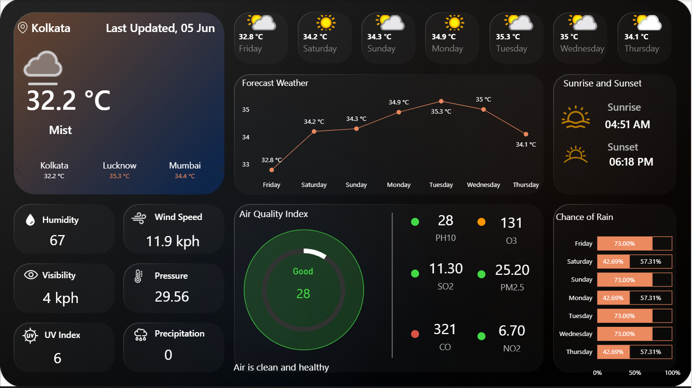

🌦️ AtmosphereIO — Real-Time Weather & Air Quality Dashboard

**A sleek, dark-themed Power BI dashboard delivering live forecasts, air quality insights, and atmospheric metrics — all in one glance.

📌 Purpose
**WeatherBoard is a comprehensive weather monitoring dashboard built entirely in Power BI, designed to give users an at-a-glance view of current weather conditions, a 7-day forecast, air quality index (AQI), and environmental metrics for multiple Indian cities. It connects to live weather APIs — eliminating the need for static CSV files — so the data stays fresh with every scheduled refresh.

🛠️ Tech Stack
          Layer                    Technology
1. BI & Visualization              Microsoft Power BI Desktop
2. Data Transformation             Power Query (M Language)
3. Measures & Logic                DAX (Data Analysis Expressions)
4. Data Format                     JSON (via REST API)
5. Publishing & Refresh            Power BI Service (scheduled auto-refresh)
6. Custom Visuals                  Native Power BI cards, donut charts, slicers, bar charts

🌐 Data Sources
          Data Type                Source
1. Current Weather (temp,          Weather REST API (JSON)
 humidity, wind, pressure,
 UV, visibility)
2. 7-Day Daily Forecast             Weather Forecast API Endpoint
3. Hourly Forecast                  Weather Forecast API Endpoint
4. Air Quality Index (PM10,         AQI API
 O3, SO2, PM2.5, CO, NO2)
5. Dynamic Weather Icons            Icon URL field from API response
6. Multi-city Support               Kolkata · Lucknow · Mumbai

⚙️ How It's Built — Step-by-Step
1. 🔌 Data Connection

**Fetches live JSON data via the Get Data → Web option in Power BI using a constructed API URL
API key is embedded in the URL query parameters
No static files — all data is pulled dynamically at refresh time

2. 🧹 Power Query & Data Preparation

**Raw JSON is cleaned and shaped inside the Power Query Editor
From the master query, three specialized tables are created using Reference (not duplicate) to avoid redundant loads:

Current Data — present conditions
Forecast Data (by Day) — daily highs and conditions
Forecast Data (by Hour) — granular hourly breakdown
Unnecessary columns are removed, data types are corrected, and duplicates are eliminated

3. 🗂️ Data Modeling

**Auto-generated relationships are removed and replaced with a clean, intentional schema
A dedicated Location Table is created and linked to all other tables
Single city slicer selection cascades updates across the entire dashboard

4. 4. 🎨 Dashboard Development

**Dark theme - applied with custom-imported background images for a professional look
Slicers - for switching between cities
KPI Cards - powered by dynamic DAX measures for temperature, wind speed, pressure, and visibility
Dynamic Weather Icons — image URLs from the API are transformed via DAX and rendered using the card's Image URL property
AQI Donut Chart — custom indicator with conditional color formatting (Green = Good, Yellow = Moderate, Red = Unhealthy)
Conditional Status Labels — text like "Air is clean and healthy" generated dynamically based on AQI thresholds
Dashboard published to Power BI Service with scheduled refresh enabled for always-live data

✨ Features & Highlights
🌡️ Current Conditions Panel

Real-time temperature, weather condition label (e.g., Mist), and city name
Multi-city switcher — Kolkata, Lucknow, Mumbai
Last-updated timestamp for data freshness

📅 7-Day Forecast Strip

Daily forecast cards with dynamic weather icons and high temperatures
Covers a full rolling 7-day window

📈 Forecast Temperature Chart

Line chart tracking temperature trends across 7 days
Data-labeled points for precise daily readings

🌬️ Atmospheric Metrics (6 KPIs)

Humidity · Wind Speed · Visibility · Pressure · UV Index · Precipitation

🍃 Air Quality Index (AQI) Gauge

Circular donut gauge with color-coded status
Individual pollutant breakdown: PM10, O3, SO2, PM2.5, CO, NO2
Dynamic summary message (e.g., "Air is clean and healthy")

🌅 Sunrise & Sunset Panel

Daily sunrise and sunset times with iconographic display

🌧️ Chance of Rain (7-Day)

Horizontal bar chart showing daily rain probability
Dual-bar layout with percentage labels

📸 Dashboard Preview:

  

🚨 Key Problems This Dashboard Solves

1. Weather data is scattered across multiple apps
Consolidates current conditions, 7-day forecast, AQI, rain probability, and sunrise/sunset into a single dark-themed view

2. Static dashboards go stale quickly
**Connects directly to live REST APIs — no CSV files. Published on Power BI Service with scheduled auto-refresh for always-current data

3. Air quality is ignored in most weather apps
**Brings AQI front and center with a donut gauge, all 6 pollutants (PM10, O3, SO2, PM2.5, CO, NO2), color-coded status, and a plain-English summary

4. Switching between cities requires separate lookups
**A single city slicer instantly updates every visual — forecast, AQI, metrics, sunrise/sunset — across the entire dashboard

❓ Key Questions & Answers
Q1. What is the current temperature and condition right now?
**🌡️ 32.2°C, Mist — recorded in Kolkata as of the last refresh on 05 Jun.

Q2. How will temperature trend over the next 7 days?
**📈 Temperatures rise steadily from 32.8°C on Friday, peaking at 35°C on Wednesday, then dipping back to 34.1°C by Thursday. Expect a consistently hot week with no major cool-down.

Q3. Is the air safe to breathe? Which pollutant is the concern?
**🍃 Overall AQI is 28 — rated Good. Air is clean and healthy for all activities. The only elevated reading is CO at 321, which is worth monitoring but within acceptable range for outdoor exposure.

Q4. What are the chances of rain this week — should I carry an umbrella?
**🌧️ Rain probability is 73% on Friday, Sunday, Tuesday, and Wednesday — carry an umbrella on those days. Saturday, Monday, and Thursday are lower risk at ~43–57%.

Q5. What time does the sun rise and set today?
**🌅 Sunrise: 04:51 AM · Sunset: 06:18 PM — giving roughly 13.5 hours of daylight.

Q6. How do weather conditions compare across cities?
**🏙️ Lucknow is the hottest at 35.3°C, followed by Mumbai at 34.4°C, and Kolkata at 32.2°C. All three cities are experiencing above-average summer heat.

🚀 Getting Started
1. Clone this repository
git clone https://github.com/anuj499/Atmosphere.git

2. Open the .pbix file in Power BI Desktop
  
3. Get your API Key from your weather data provider and paste it into the API URL inside Power Query
> Go to Transform Data → Query Settings → Source step
> Replace YOUR_API_KEY in the URL

4. Refresh the data — Power Query will pull live JSON and populate all visuals

5. (Optional) Publish to Power BI Service and configure a scheduled refresh for always-live data

🔑 API Key Setup
**Sign up at weatherapi.com to get your free API key. Inside Power Query, the source URLs will look like:
Current Weather + AQI:
https://api.weatherapi.com/v1/current.json?key=YOUR_API_KEY&q=Kolkata&aqi=yes

7-Day Forecast:
https://api.weatherapi.com/v1/forecast.json?key=YOUR_API_KEY&q=Kolkata&days=7&aqi=yes&alerts=no

**Replace YOUR_API_KEY with the key from your WeatherAPI.com dashboard, and swap Kolkata with any city name to switch locations.

## 📜 License

MIT License — Free for personal and commercial use. Templates may be modified and redistributed with attribution.

## 🙏 Credits

- Power BI Community
- Microsoft Power BI Team
- Template Contributors

---

**⭐ Star this collection if you find it useful for your data journey! ⭐**
